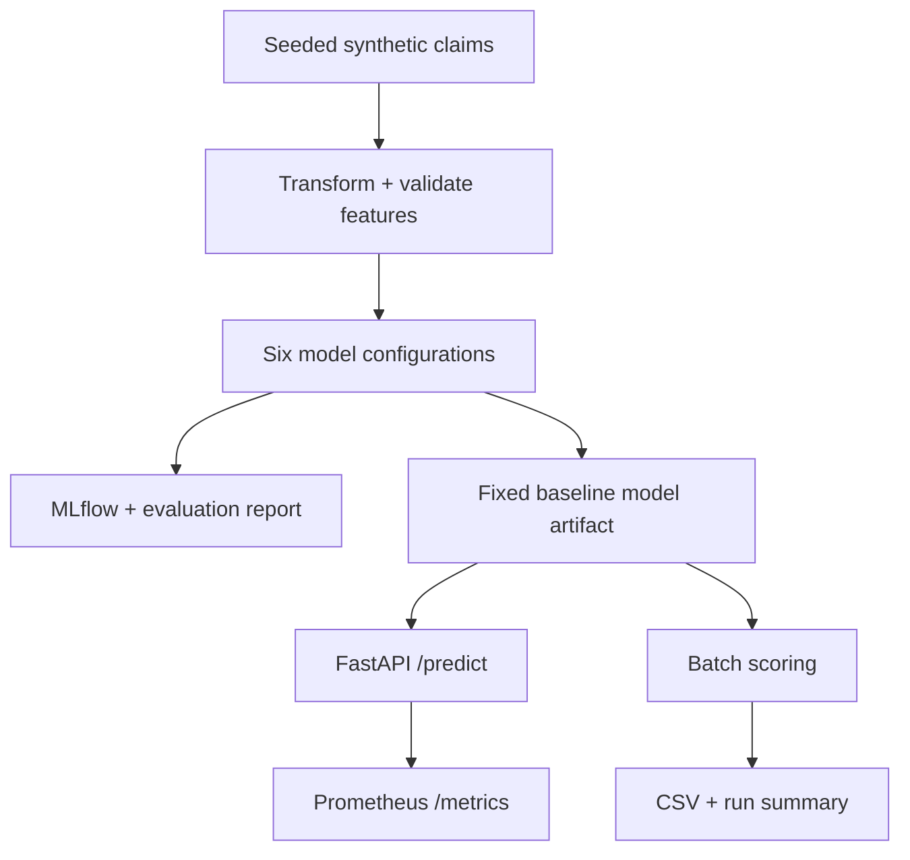
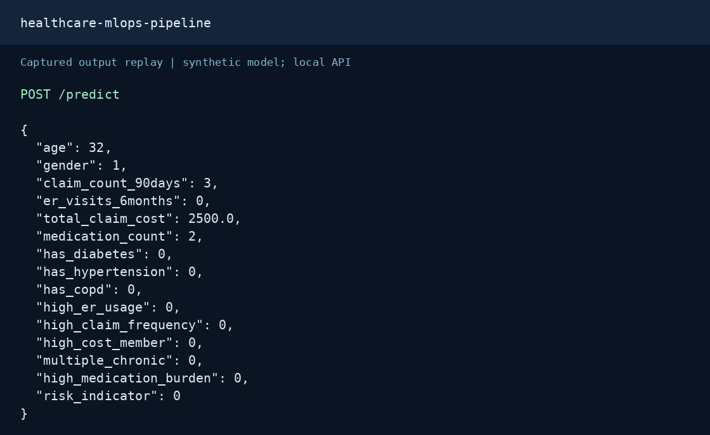

# Healthcare MLOps Simulation

[](https://github.com/Ramesh-Murala/healthcare-mlops-pipeline/actions/workflows/mlops_pipeline.yml)

A local MLOps demonstration using **synthetic insurance-claims data**: generate records, transform features, compare models, serve predictions, expose Prometheus metrics, and run batch scoring.

This is an independent portfolio simulation. It is not affiliated with an insurer, clinically validated, deployed to production, or certified as HIPAA compliant. Do not use it for patient-care or insurance decisions.


## Visual proof

### Architecture



### Request and response replay



This GIF renders actual captured JSON as an animated transcript; it is not a screen recording. POST `/predict` using FastAPI TestClient and the locally trained synthetic random-forest baseline. The request supplies precomputed features. Any `latency_ms` is a single local sample, not a performance benchmark.

### Evaluation results

| Configuration | Accuracy | F1 | ROC-AUC |
|---|---:|---:|---:|
| random forest baseline | 0.885 | 0.914 | 0.955 |
| gradient boosting baseline | 0.920 | 0.941 | 0.965 |
| random forest shallow | 0.920 | 0.941 | 0.961 |
| scaled logistic regression | 0.900 | 0.928 | 0.959 |
| gradient boosting slow | 0.925 | 0.944 | 0.967 |
| random forest depth7 | 0.920 | 0.940 | 0.960 |

[Recorded evaluation](reports/synthetic_evaluation.json): 800 training and 200 held-out synthetic rows, seed 42. All configurations predict the same rule-generated label. The exported random-forest baseline was selected in advance. These scores do not establish clinical performance.

### Sample request

```json
{
  "age": 32,
  "gender": 1,
  "claim_count_90days": 3,
  "er_visits_6months": 0,
  "total_claim_cost": 2500.0,
  "medication_count": 2,
  "has_diabetes": 0,
  "has_hypertension": 0,
  "has_copd": 0,
  "high_er_usage": 0,
  "high_claim_frequency": 0,
  "high_cost_member": 0,
  "multiple_chronic": 0,
  "high_medication_burden": 0,
  "risk_indicator": 0
}
```

### Captured response

```json
{
  "risk_score": 0.0,
  "risk_label": 0,
  "risk_category": "Low Risk",
  "scope": "Synthetic demonstration; not for clinical decisions",
  "latency_ms": 9.31
}
```

Reproduce the capture and GIF from the repository root:

```bash
pip install -r requirements.txt pillow
# First run the data/training steps below to create api/model.pkl.
python docs/capture_demo.py
python docs/render_replay.py
```

The renderer needs DejaVu Sans Mono (on Debian/Ubuntu: `fonts-dejavu-core`). [Capture metadata](docs/assets/capture.json) records the source revision. [Request JSON](docs/assets/request.json) and [response JSON](docs/assets/response.json) are available separately.

## What is implemented

| Stage | Implementation |
|---|---|
| Data | 1,000 synthetic records, seeded Python/NumPy/Faker generation |
| Transformation | Hash synthetic member IDs, remove ZIP codes, derive risk features |
| Training | Six model configurations evaluated against the same synthetic risk label |
| Tracking | Local MLflow experiment, metrics, model artifacts |
| Serving | FastAPI `/predict`, `/health`, `/metrics` |
| Monitoring | Prediction count and latency metrics; a Prometheus scrape configuration |
| Batch scoring | Sequential Python tasks, dated CSV output, JSON run summary |
| CI | Fresh data generation, training, batch run, tests, Docker build and health check |

The six configurations do not represent six independently validated clinical use cases. The target is generated from rules in `src/generate_data.py`; good held-out scores mainly show that models approximate those rules.

## Reproduce from a clean checkout

Python 3.11 or 3.12; run commands from the repository root:

```bash
python -m venv .venv
source .venv/bin/activate  # Windows: .venv\Scripts\Activate.ps1
pip install -r requirements.txt
python src/generate_data.py
python src/anonymize.py
python src/features.py
python src/validate.py
python src/train.py
python pipelines/nightly_pipeline.py
python -m pytest -q
uvicorn api.app:app --host 127.0.0.1 --port 8000
```

Training exports `api/model.pkl` for serving and writes `reports/synthetic_evaluation.json`. The random-forest baseline is selected in advance for export; test-set results are for comparison, not model selection. The other configurations are logged to MLflow. Run `mlflow ui --backend-store-uri sqlite:///mlflow.db` to inspect runs.

## Docker

After running the data and training steps above:

```bash
docker build -t healthcare-risk-api -f api/Dockerfile .
docker run --rm -p 8000:8000 healthcare-risk-api
```

Open `http://localhost:8000/docs`. Generate the model and build the image with matching scikit-learn dependencies; pickle artifacts are version-dependent and must only come from trusted training runs. `MODEL_PATH` can override the model location.

## Evidence and limitations

- [Synthetic evaluation](reports/synthetic_evaluation.json) records the split, configurations, and scores. Dependency versions can affect exact results.
- Tests reject invalid data, check prediction/metrics endpoints, and ensure batch failures propagate to schedulers.
- The batch script is manually executable; there is no deployed Airflow scheduler or nightly schedule.
- Prometheus metrics are implemented. Grafana dashboards, drift detection, alerts, cloud deployment, and model promotion are not included.
- Hashing IDs and dropping a column demonstrate transformations; they do not establish anonymization or regulatory compliance.
- The API accepts precomputed features. A production service needs shared feature computation, consistency checks, authentication, model lineage, and robust multi-worker monitoring.

Generated databases, model binaries, logs, caches, and data are excluded from Git. Recreate them with the commands above; earlier versions remain in Git history.
